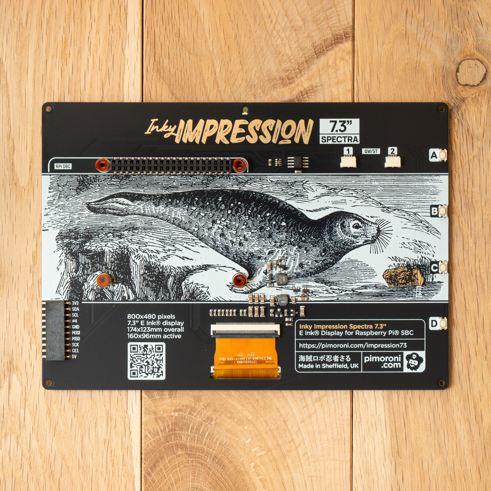
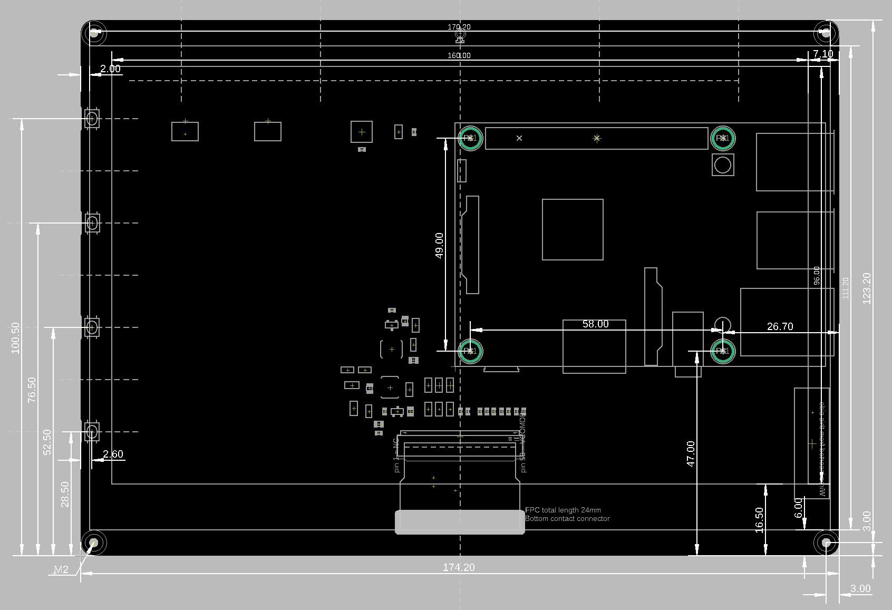

# Inky Impression 7.3" (Spectra 6) — Hardware Reference

Standalone mechanical/hardware reference for Pimoroni's Inky Impression 7.3"
Spectra 6 e-ink display board (SKU **PIM773**). Compiled from Pimoroni's
published tech specs, product photos of the board's front and rear faces,
and Pimoroni's dimensional (mechanical) drawing. Not tied to any particular
enclosure or project — intended to be reusable by anyone who needs
mechanical facts about this board.

**Confidence key:**
🟢 official Pimoroni spec (verbatim published data) · 🔵 directly labelled or
legible on the dimensional drawing / photo · 🟡 inferred from geometry or
context, plausible but not explicitly labelled · 🔴 rough visual estimate
from the photo only — treat as a starting point, not a number to build to.

**Sources**
1. Pimoroni's published tech specs table (§1).
2. Product photo of the board's front face (§2).
3. Product photo of the board's rear face (§2).
4. Pimoroni's dimensional drawing (§2).

---

## 1. Official specifications (Pimoroni)

| Spec | Value |
|---|---|
| Product name | Inky Impression 7.3" (Spectra 6 Edition) |
| SKU | PIM773 |
| Resolution | 800 × 480 px |
| Technology | E Ink Spectra 6® |
| Colours | 6 (red, green, blue, yellow, black, white) |
| Dot pitch | 0.20 × 0.20 mm |
| Aspect ratio | 5:3 |
| Pixels per inch (PPI) | 127 |
| Board dimensions (W×H) | 174.2 × 123.2 mm |
| Usable area dimensions (W×H) | 160 × 96 mm |
| Refresh time | 28 s** |
| Recommended temperature | 0–50 °C |

The two numbers everything else in this document hangs off: **board
174.20 × 123.20 mm**, **usable area 160 × 96 mm**.

Sanity check: `800 px × 0.20 mm/px = 160 mm` and `480 px × 0.20 mm/px = 96 mm`
— resolution × dot pitch reproduces the usable area exactly, so the spec
table is internally consistent. 🟢

---

## 2. Source images

**Front-view photo:**

**Rear-view photo:**

**Dimensional drawing:**

---

## 3. Orientation and what the drawing actually shows

The photo and the drawing are **not** in the same handedness:

- The **photo** is a normal rear-view shot: what you see is what's
  physically there when you look at the back of the board.
- The **dimensional drawing** is **horizontally mirrored** relative to the
  physical board. Confirmed by cross-referencing one feature that appears in
  both: the 10-pin debug header (§7) sits at **bottom-left in the photo**
  but **bottom-right in the drawing**.

Mirror any X coordinate read off the drawing
(`x_physical = board_width − x_drawing`) before using it, or before
comparing it to the photo.

The drawing also mixes dimensions for **both faces of the board** in one
view: the usable-display/bezel-border dimensions in §4 describe the
**front** face (where the E Ink panel sits), while the mounting holes,
buttons, headers and connectors in §5–§8 are all **rear**-face features —
every one of them is visibly populated in the rear-view photo. Nothing in
the drawing separates the two visually; it has to be inferred per-dimension.

---

## 4. Front face — display stack-up (module vs. active area vs. PCB)

Three nested rectangles on the front face, all on the same PCB:

| Layer | Size (W × H) | Confidence |
|---|---|---|
| PCB outline | 174.20 × 123.20 mm | 🟢 official spec |
| Epaper glass module | 170.20 × 111.20 mm | 🔵 drawing callouts, confirmed |
| Active pixel area | 160 × 96 mm | 🟢 official spec |

Gaps between them:

| Gap | Value | Confidence |
|---|---|---|
| PCB edge → module edge, left/right | 2.00 mm each side | 🔵 drawing callout, and matches `(174.20 − 170.20) / 2 = 2.00` exactly |
| PCB edge → module edge, top+bottom combined | 12.00 mm total | 🔵 derived: `123.20 − 111.20`; the split between top and bottom isn't confirmed |
| PCB edge → active pixel area, left/right | 7.10 mm each side | 🔵 drawing callout, matches `(174.20 − 160.00) / 2 = 7.10` exactly |
| PCB edge → active pixel area, bottom | 16.50 mm | 🔵 drawing callout, confirmed |
| PCB edge → active pixel area, top | 10.70 mm | 🔵 derived: `123.20 − 96.00 − 16.50 = 10.70` |

So the module and the active area are both symmetric left/right (2.00 mm
and 7.10 mm respectively) but shifted toward the top edge vertically — the
active area's borders are confirmed asymmetric (16.50 mm bottom vs.
10.70 mm top); the module's top/bottom split isn't individually confirmed,
only its 12.00 mm total.

The front-view photo in §2
visually corroborates this: the bezel strip below the display (carrying the
"Pimoroni Inky Impression Spectra 7.3"" text) is noticeably wider than the
strip above it.

The front-view photo also shows the FPC ribbon exiting through a slot in
the bezel at bottom-center — consistent with the drawing's "Bottom contact
connector" callout (§8, §10) — and all 4 corner mounting holes (§5) passing
all the way through the board, visible from the front as well as the rear.

---

## 5. Rear face — mounting holes

| Property | Value | Confidence |
|---|---|---|
| Count / thread | 4×, one per corner, **M2** (drawn as slots, not plain round holes) | 🔵 labelled in the drawing |
| Corner inset, all 4 corners, both directions | 3.00 mm from the nearest edge | 🔵 confirmed — only the drawing's bottom-right corner (= physical bottom-left, per §3 mirroring) is explicitly dimensioned (two separate callouts, one per direction), but it applies uniformly to all 4 corners |

An earlier version of this document misread `170.20` and `111.20` as
possible hole-to-hole spans, which conflicted with a 3.00 mm corner inset.
Both are actually front-face dimensions — the epaper module's width and
height (§4) — and don't describe the mounting holes at all. With that
correction there's no remaining conflict, and no other data point suggests
anything other than a uniform 3.00 mm inset on all 4 corners.

---

## 6. Rear face — button switches

Four tactile buttons, labelled **A / B / C / D** in the photo, all mounted
along one edge of the board.

| Property | Value | Confidence |
|---|---|---|
| Positions along the edge (from the board's corner on that edge) | 28.50 / 52.50 / 76.50 / 100.50 mm | 🔵 drawing's dashed dimension lines |
| Switch body inset from the edge | 2.60 mm | 🔵 drawing callout |
| Switch body size (perpendicular to the edge) | not confirmed | 🔴 no labelled dimension found for this in either source |
| Switch body size (along the edge) | not confirmed | 🔴 same |

The switch body's own footprint size is the one dimension in this whole
document that isn't backed by anything better than a visual estimate — if a
design depends on it, measure the actual tactile switch directly.

---

## 7. Rear face — Raspberry Pi GPIO header

| Property | Value | Confidence |
|---|---|---|
| Type | 40-pin, 2×20, female header socket | 🔵 visible in the photo, labelled "RPI SBC" |
| Location | along the top edge, spanning most of the board's width | 🔵 |
| Type | drawn as slots (elongated), not plain round holes — same as the M2 corner holes in §5 | 🔵 |
| Nearby standoff screw grid — spacing | 2 columns × 2 rows: columns 58.00 mm apart, rows 47.00 mm and 96.00 mm from the bottom edge (49.00 mm apart) | 🟡 inferred from the drawing's `58.00` / `47.00` / `49.00` callouts, and 4 matching screws visible in the photo (2 flanking the header, 2 more directly below them) |
| Nearby standoff screw grid — absolute position | right-hand column is 26.70 mm from the board's right edge → board-local X = `174.20 − 26.70 = 147.50 mm`; left-hand column = `147.50 − 58.00 = 89.50 mm` | 🔵 the drawing labels `26.70` as the distance from the board edge to the middle of this screw slot, resolving the absolute placement |

The screw grid's spacing and absolute X position are now both confirmed by
labelled dimensions. The rows' absolute Y position (47.00 / 96.00 mm from
the bottom edge) is still only 🟡, since those numbers are read off the
drawing without an explicit "distance from bottom edge" label to match how
`26.70` was labelled for X.

---

## 8. Rear face — debug / breakout header

| Property | Value | Confidence |
|---|---|---|
| Pinout | 3V3, SDA, SCL, #4, GND, MOSI, MISO, SCK, CE1, 5V (10 pins) | 🔵 silkscreen labels, directly legible in the photo |
| Location | one bottom corner — bottom-left in the photo, bottom-right in the (mirrored) drawing | 🔵 |
| Footprint / extent from the board edges | not confirmed | 🔴 no dimension in the drawing could be reliably tied to this header specifically |

If a project needs this header's exact footprint (e.g. for a case cutout or
a keep-out zone), measure it directly with calipers.

---

## 9. Rear face — other populated components (from the photo)

| Component | Approx. location | Notes |
|---|---|---|
| LED | top-center, next to the title silkscreen | status/activity LED |
| Small SOIC chip | right of the GPIO header's right-hand screw | unlabelled at photo resolution — possibly an EEPROM or I/O expander |
| 2× JST-SH connectors, labelled "1" / "2" under "QW/ST" | top area, right of the GPIO header | Qwiic / STEMMA QT breakouts |
| 2× SMD inductors, printed "150" | center of the board | likely part of the E Ink panel's boost power supply |
| FPC ZIF connector | bottom-center | labelled "Bottom contact connector" in the drawing, "FPC total length 24mm", pins numbered from "pin 1 = NC" up to roughly "pin 59" |
| QR code | bottom-left, next to the on-board spec text | links to the product page |
| Text block | bottom-right | "Inky Impression Spectra 7.3" / "E Ink® Display for Raspberry Pi® SBC" / `https://pimoroni.com/impression73` / "Made in Sheffield, UK" / pimoroni.com logo |
| Buttons A–D | one edge, at the 4 positions in §6 | printed circular button caps over the tactile switches |
| "Seal" illustration covering the middle of the board | — | **decorative marketing overlay, not a physical PCB feature** — almost certainly a sample of what the E Ink panel can render, composited onto the product photo for marketing. Ignore it when reasoning about component clearance. |

---

## 10. Every dimension callout in the drawing, transcribed

Everything legible in the drawing, independent of interpretation, so anyone
can re-derive something themselves without re-reading the source image.

| Value | Approx. location | Best-guess meaning | Confidence |
|---|---|---|---|
| 174.20 | bottom, full width | board width | 🟢 official spec |
| 123.20 | right side, full height | board height | 🟢 official spec |
| 2.00 | top-left (drawing) = top-right (physical) | PCB edge to the epaper module's physical edge, front face (§4) — **not** a mounting-hole dimension | 🔵 confirmed |
| 170.20 | top, spanning most of the width | epaper glass module's width, front face (§4) — **not** a hole-to-hole span | 🔵 confirmed |
| 7.10 | top-right | usable-area side border | 🔵 matches `(174.20−160.00)/2` exactly |
| 160.00 | top, inner span | usable area width | 🟢 official spec |
| 96.00 | right side | usable area height | 🟢 official spec |
| 111.20 | right side, near the "96.00" span | epaper glass module's height, front face (§4) — **not** a hole-to-hole span | 🔵 confirmed |
| 100.50 / 76.50 / 52.50 / 28.50 | one column, dashed lines | button positions along their edge | 🔵 |
| 2.60 | near the button reference lines | switch body inset from the edge | 🔵 |
| 49.00 | mid-board, vertical, between two circled points | standoff row spacing | 🟡 |
| 58.00 | mid-board, horizontal | standoff column spacing | 🟡 |
| 47.00 | mid-board, vertical, from the bottom edge | standoff lower row position | 🟡 |
| 26.70 | mid-right | distance from the board's right edge to the middle of the right-hand Pi-standoff screw slot (§7) | 🔵 confirmed |
| 16.50 | bottom-right region of the drawing | usable area's bottom border (front face) | 🔵 confirmed |
| 6.00 | adjacent to "16.50" | unclear — proximity to the border dimension doesn't necessarily mean it's related | 🔴 |
| 3.00 (×2, two separate callouts) | bottom-right corner | distance from the right edge, and separately from the bottom edge, to the middle of the bottom-right corner's M2 mounting slot — applies to all 4 corners (§5) | 🔵 confirmed |
| "M2" | one bottom corner mounting hole | mounting hole thread size | 🔵 |
| "FPC total length 24mm" | bottom-center | display ribbon cable length | 🔵 explicit label |
| "Bottom contact connector" | bottom-center | FPC connector type | 🔵 explicit label |
| "pin 1 = NC" / "pin 59 ..." | bottom-center, near the FPC connector | FPC connector pinout reference | 🔵 explicit label (exact end pin count not fully legible — 59 or 60) |

---

## 11. Open items / unconfirmed measurements

- **Switch body footprint** (§6) — no labelled dimension found for this;
  measure directly if it matters.
- **Debug header footprint** (§8) — no dimension in the drawing could be
  reliably tied to it; measure with calipers if needed.
- **Module-to-PCB vertical gap split** (§4) — the 12.00 mm total (top+bottom
  combined) is confirmed, but how much of that is above vs. below the
  module isn't.
- **`6.00` callout** (§10) — location noted, meaning not determined.
- **PCB thickness** — not stated anywhere in these sources.
- **Standoff screw grid's row (Y) position** (§7) — the `47.00` / `96.00`
  callouts are read as "distance from the bottom edge," matching how
  `26.70` was confirmed for X, but that Y-axis orientation itself isn't
  explicitly labelled the way `26.70` was.
